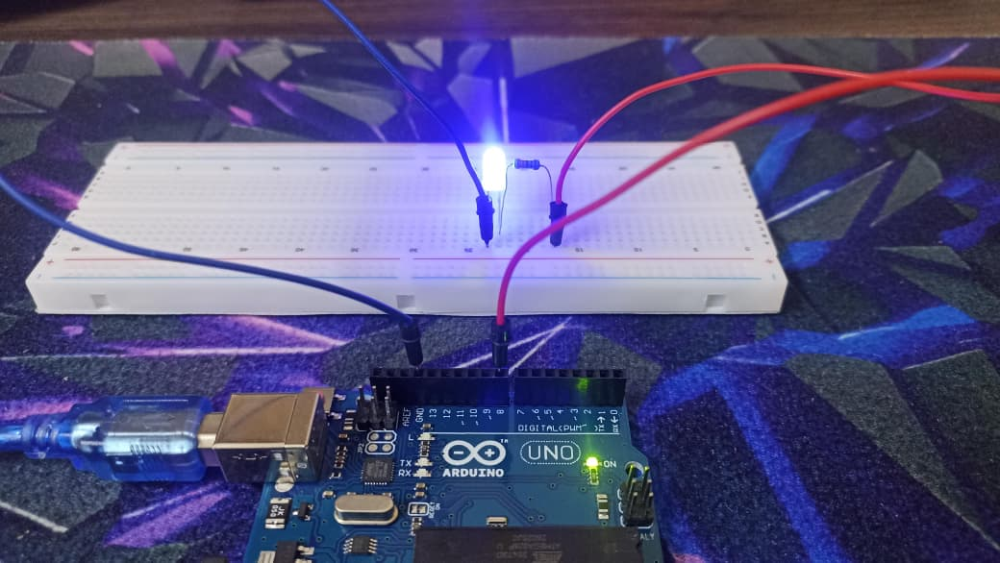
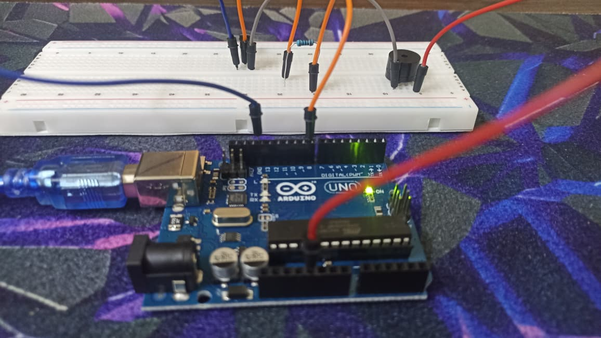
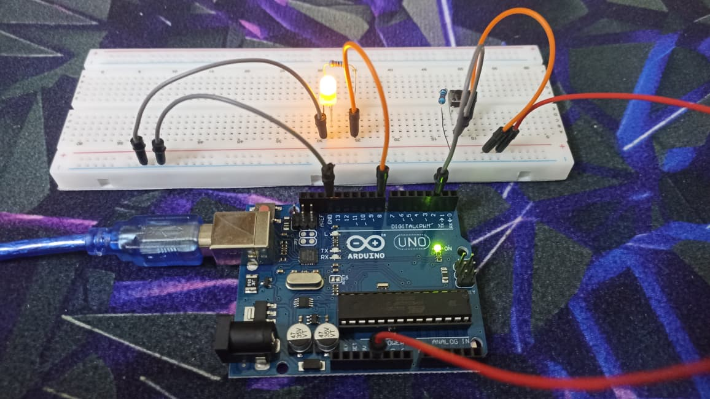
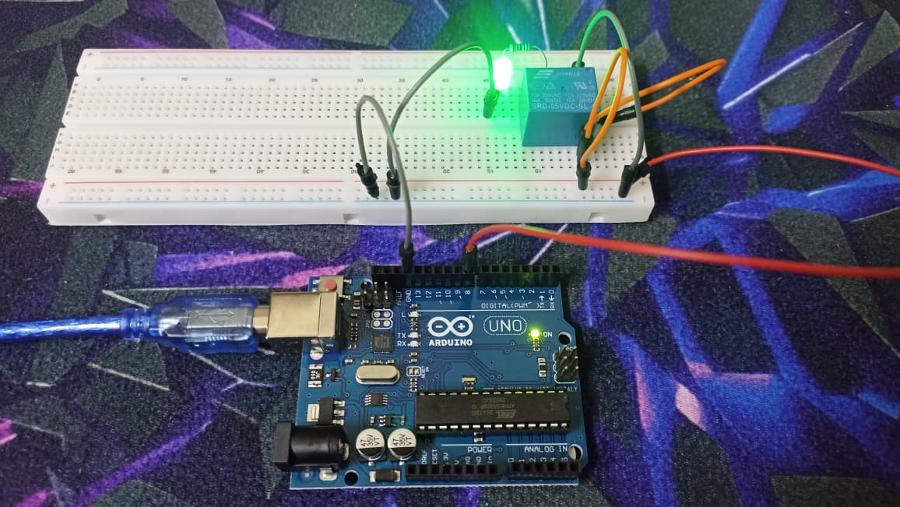
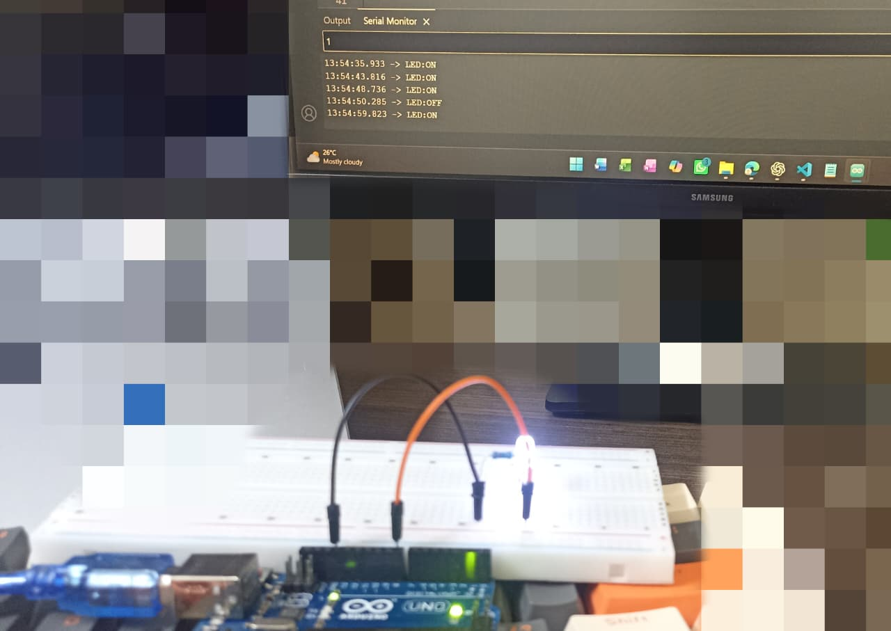
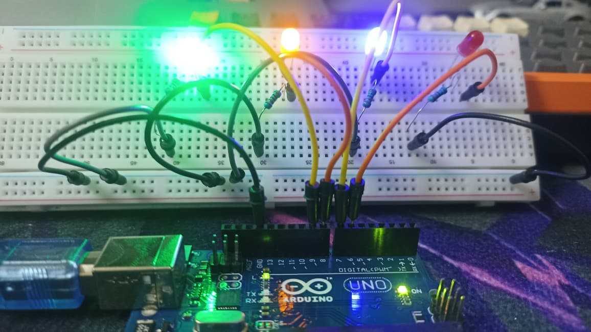

## ELECTRONICS LEARNING JOURNEY

> Documenting my personal Arduino Projects as I delve into the world of electronics.

Monday, 22/06/2026 marks the day I started my hands-on journey in Electronics (and beyond). I will be documenting my 'e-adventure' as I go through the Starter Kit for R3 UNO MEGA 2560, by Adeept (compatible with Arduino IDE).

Each Lesson (or mini project) will include:
* Circuits,
* Commented Source Code,
* Personal Notes,
* Other important information to track my growth over time.

Throughout this project, I will be programming the Arduino using the 'Arduino IDE', which serves as the development environment for writing, uploading, and testing code.

> **💎Note:** You may also go to `0x_notes.jpeg` to see my Learning Notes.

## PROGRESS

| Project | Topic  |
|---------|--------|
| 01      | [Blinking an LED](#01--blinking-an-led) |
| 02      | [Active Buzzer](#02--active-buzzer) |
| 03      | [Controlling an LED with a Button](#03--controlling-an-led-with-a-button) |
| 04      | [Controlling a Relay](#04--controlling-a-relay) |
| 05      | [Serial Port](#05--serial-port) |
| 06      | [LED Flowing Lights](#06--led-flowing-lights) |

---

# 01 – Blinking an LED

### Objective
Using Arduino Digital pins to control LEDs. 5V to turn LED ON and 0V to turn LED OFF.

### Components Used
- Arduino MEGA 2560
- USB Cable 
- 220 Ω Resistor 
- LED 
- Breadboard 
- Jumper Wires 

### Excerpt Arduino Code
```arduino
void setup()
{
  pinMode(ledPin, OUTPUT);    // Configure pin 8 to OUTPUT mode
}

void loop()
{  
  digitalWrite(ledPin, HIGH); // HIGH Output 5V (LED ON)

  digitalWrite(ledPin, LOW);  // LOW Output 0V/Ground (LED OFF)
} 
```

[View Full Source Code](mini_projects/01_blinking_an_led/01_code.ino)

### Circuit



---

# 02 – Active Buzzer

### Objective
Make a Buzzer sound in a specific pattern.

### Components Used
- Arduino MEGA 2560 
- USB Cable  
- Active Buzzer  
- 1 kΩ Resistor  
- NPN Transistor (S8050)  
- Breadboard 
- Several Jumper Wires

### Excerpt Arduino Code
```arduino
void loop()
{  
  for (int i = 0; i < 10; i++) {  // Quickly alternate between ON and OFF

    digitalWrite(buzzerPin,HIGH); // Set PIN 8 as HIGH = 5 v 
    delay(100);                   // Set the delay time，100ms 

    digitalWrite(buzzerPin,LOW);  // Set PIN 8 as LOW = 0 v 
    delay(100);                   // Set the delay time，100ms
  }
}
```

[View Full Source Code](mini_projects/02_active_buzzer/02_code.ino)

### Circuit



---

# 03 – Controlling an LED with a Button

### Objective
Understand how Buttons can be used as INPUTs to control LEDs.

### Components Used
- Arduino MEGA 2560  
- USB Cable 
- Push Button 
- LED 
- 10 kΩ Resistor 
- 220 Ω Resistor 
- Breadboard 
- Several Jumper Wires 

### Excerpt Arduino Code
```arduino
void loop()
{
  if(digitalRead(btnPin)==HIGH) // When the Circuit is completed, ...
  {
    digitalWrite(ledPin, HIGH); // ... Turn the LED ON.
  }
  else                          // When the Circuit is broken, ...
  {
    digitalWrite(ledPin, LOW);  // ... Keep the LED OFF.
  }
}
```

[View Full Source Code](mini_projects/03_controlling_led_with_button/03_code.ino)

### Circuit



### ⚠️ Challenges
Unfortunately, I was not able to implement a pull-up resistor configuration. Instead, I used a pull-down resistor to keep the INPUT pin at a stable LOW state whenever the button was NOT pressed, preventing the floating input from picking up electromagnetic interference (EMI).

---

# 04 – Controlling a Relay

### Objective
To understand how Relay switching works.

### Components Used
- Arduino MEGA 2560 
- USB Cable 
- 1 kΩ Resistor 
- 220 Ω Resistor 
- Relay  
- LED 
- Breadboard 
- Several Jumper Wires 

### Excerpt Arduino Code
```arduino
void loop()                     // Repeatedly switch the Relay's path
{
  digitalWrite(relayPin, HIGH); // Switch relay to Normally Open (NO) Pin.
  delay(1000);                  // Wait for a second

  digitalWrite(relayPin, LOW);  // Switch relay back to Normally Closed (NC) Pin.
  delay(1000);                  // Wait for a second
}
```

[View Full Source Code](mini_projects/04_controlling_relay/04_code.ino)

### Circuit



### ⚠️ Challenges
- At first, it was hard to identify the pins of the relay. Each of the 5 pins serve a specific purpose and hence is important to distinguish between Normally Opened (NO), Normally Closed, Common, and Coil pins.
- Also, I was NOT able to use a Transistor and a Diode to make the circuit 'safer'.

---

# 05 – Serial Port

### Objective
Controlling an LED via data (1 or 0) received from PC.

### Components Used
- Arduino MEGA 2560
- `Keyboard` and `Screen Monitor`
- USB Cable 
- 220 Ω Resistor 
- LED 
- Breadboard 
- Jumper Wires 

### Excerpt Arduino Code
```arduino
if(Serial.available() > 0) {
  receivedValue = Serial.read();  // Store the received data (1 | 0) in the variable

  if(receivedValue == '1') {      // If User types 1 on their PC ...
    digitalWrite(ledpin, HIGH);   // ... light the LED ON
    Serial.println("LED:ON");
  }

  if(receivedValue == '0') {      // If User types 0 on their PC ...
    digitalWrite(ledpin, LOW);    // ... turn the LED OFF
    Serial.println("LED:OFF");
  }
}
```

[View Full Source Code](mini_projects/05_serial_port/05_code.ino)

### Serial Monitor conmmand line



---

# 06 – LED Flowing Lights

### Objective
Build a `parallel` circuit of alternating LEDs (between ON/OFF).

### Components Used
- Arduino MEGA 2560
- USB Cable 
- **4** * 220 Ω Resistor 
- **4** * LED 
- Breadboard
- Jumper Wires

### Excerpt Arduino Code
```arduino
void setup() {
  unsigned char ledPin;    // Variable used to represent LED pins 6-9.

  // Configure digital pins 6, 7, 8, and 9 as OUTPUT pins.
  for (ledPin = 6; ledPin <= 9; ledPin++) {
    pinMode(ledPin, OUTPUT);
  }
}
```

[View Full Source Code](mini_projects/06_led_flowing_lights/06_code.ino)

### Circuit



### ⚠️ Challenges

- The `Red` LED would not light ON, no matter what.
- I suspected that the `resistor` was faulty, and hence used a multi-meter to check.
- Nevertheless, even if 1 component was faulty, the rest of the circuit was working.

---

_More such projects will be added as I continue exploring the world of electronics._